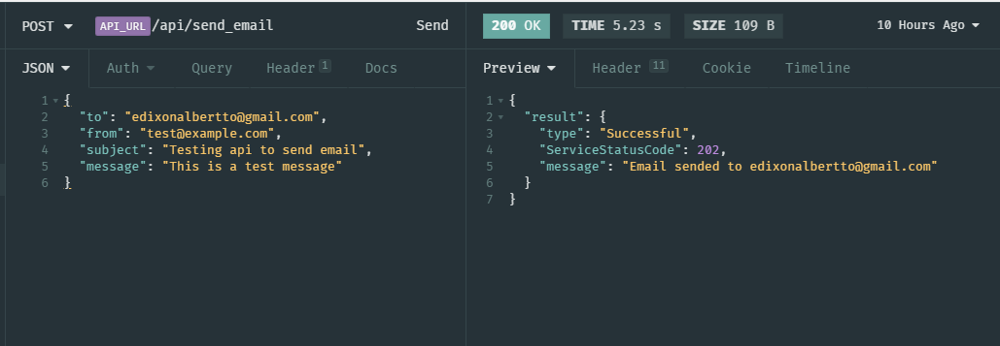

# api-email-sendgrid

[](https://linkedin.com/in/edixonalberto)
[](./LICENSE.md)


Api to send email through of service the Sendgrid


### Starter

Install all the dependencies.

```sh
npm install
```

Create file `.env` with the keys they are in the template.

```sh
copy template.env .env
```

Add the environment variables.

- create a **SENDGRID_API_KEY** logging into your
  [sendgrid account](https://app.sendgrid.com/) &#x279c;

- create a **SERVER_API_KEY** executing the command `create-apikey`.

```sh
npm run create-apikey
```

Start api in mode development.

```sh
npm run start:dev
```

### Main Commands

```sh
npm start:dev # mode development
npm start:prod # mode production

npm build # build application
npm start # mode server
```

### Endpoints List

| Endpoint          | HTTP | Description      |
| ----------------- | ---- | ---------------- |
| `/api`            | GET  | Check api status |
| `/api/send_email` | POST | Send a email     |

### Request Example


